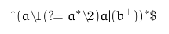
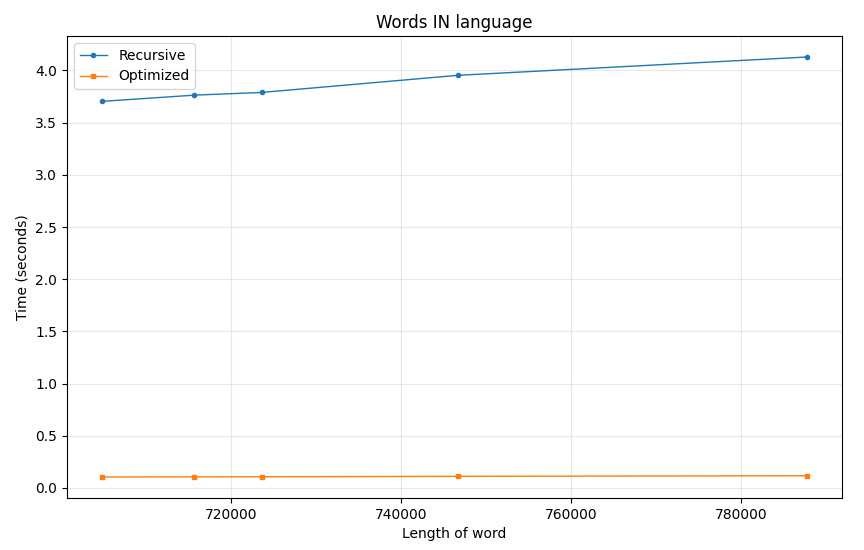
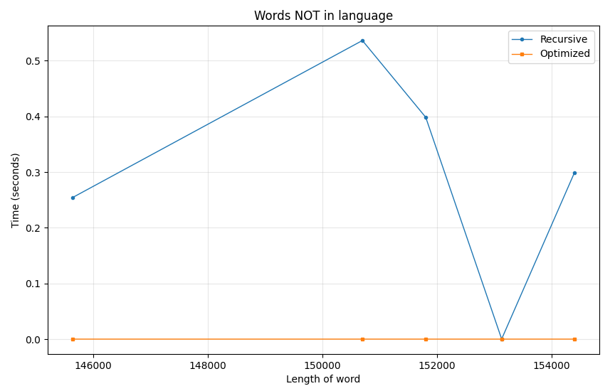

# Лабораторная работа №4.

## Вариант 4.

## Контекстная свобода

Язык не является контекстно свободным.

Пересечем исходный язык с регулярным выражением 
$R = b^+ a b^+ a b^+$

То есть такому языку $L_1 = L \cap R$ будут принадлежать все строки вида $b^n a b^m a b^k, n, m, k \ge 1 \space and \space n \ge m \space and \space k \ge m$

Применим лемму о накачке для слова $w = b^Nab^Nab^N \in L_1$ с длинной накачки N.

Рассмотрим разбиение слова $w = uvxyz$ и рассмотрим все варианты накачки.

1. Если $vxy$ полностью лежит в одном из крайних блоков $b^N$, то при отрицательной накачке получятся слова $b^{N-i}ab^Nab^N \notin L_1$ и $b^Nab^Nab^{N-i} \notin L_1$. Также при положительной накачке среднего блока слово $b^Nab^{N+i}ab^N \notin L_1$. 

2. Если $vxy$ содержит a, то есть лежит на стыке двух блоков $b^N$, то также при положительной наакачке нарушится одно из условий $n \ge m \space$ и $\space k \ge m$, а при изменении количества букв a слово также перестанет входить в язык $L_1$. 

Поэтому не существует такой накачки, при котором слово останется в языке, то язык $L_1$ не контекстно-свободный.

Так как контекстно-свободные языки замкнуты относительно пересечения с регулярными языками, то и исходный язык L не контекстно-свободный.

## "Наивный" парсер

"Наивный" парсер находится в файле [fazz.cpp](fazz.cpp) в функции `parse_language`.

## Оптимизированный парсер

Оптимизированный парсер находится в файле [fazz.cpp](fazz.cpp) в функции `optimized_parse_language`.

В начале он проверяет на инвариант, и при его отсутствии отвергает слово. Проверяются инвариант:
- Слово должно начинаться и заканчиваться буквой b.

После проверки инварианта парсер проходит по слову ровно один раз без повторного просмотра одних и тех же частей. Поэтому алгоритм имеет вычислительную сложность O(n). Также в этой реализации группы хранятся не строками, а количеством букв в них, потому что у групп есть фиксированная структура.

## Фазз-тестирование

Код фазз-тестрования находится в файле [fazz.cpp](fazz.cpp). Были построены графики сравнения скорости работы парсеров на словах, принадлежащих языку и не принадлежащих языку.

